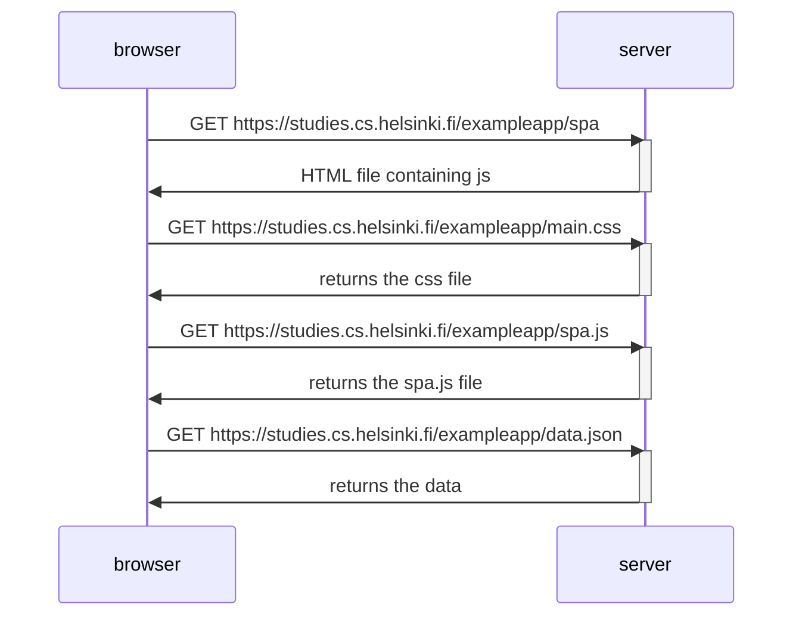

```mermaid
sequenceDiagram 
    participant browser
    participant server 

    browser ->> server: GET https://studies.cs.helsinki.fi/exampleapp/spa
    activate server 
    server ->> browser: HTML file containing js 
    deactivate server 

    browser ->> server: GET https://studies.cs.helsinki.fi/exampleapp/main.css
    activate server 
    server ->> browser: returns the css file
    deactivate server 

    browser ->> server: GET https://studies.cs.helsinki.fi/exampleapp/spa.js
    activate server 
    server ->> browser: returns the spa.js file
    deactivate server 

    browser ->> server: GET https://studies.cs.helsinki.fi/exampleapp/data.json
    activate server 
    server ->> browser: returns  the data
    deactivate server
```
